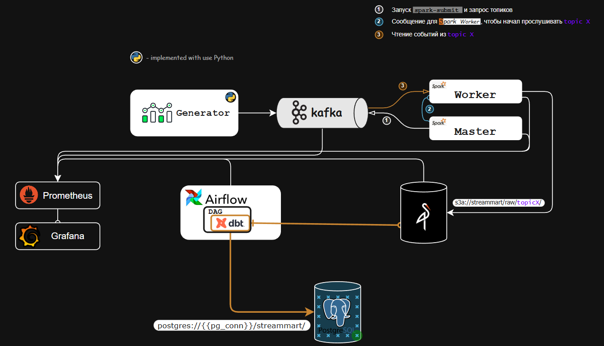

# Stream Mart

> Pipeline сбора данных из интернет магазина для дальнейшей аналитики.

## Стек

Технология       | Версия/Образ
-|-
Python           | python:3.11
Apache Kafka     | apache/kafka:3.9.0
MinIO            | minio/minio:RELEASE.2024-11-07T00-00-00Z
PostgreSQL       | postgres:16.2-alpine
Spark            | spark:3.5.3
Apache Airflow   | apache/airflow:2.10.2-python3.11
dbt              | 1.9.0
Prometheus       | prom/prometheus:v2.55.0
Grafana          | grafana/grafana:11.3.0

## Архитектура

> Архитектура представлена в формате `.drawio`, для открытия рекомендуется установить расширение [Draw.io Intergration](https://marketplace.visualstudio.com/items?itemName=hediet.vscode-drawio) или открыть файл через [draw.io](https://draw.io)

Сам файл находится [здесь](docs/diagrams/arch.drawio).



## Деплой и Развертывание

> Пока проект в разработке, деплой и развертывание будут добавлены когда версия стабилизируется (***v1.0*** и выше, без постфикс ***`beta`***)

## Quick Start

> Чтобы развернуть локально на хосте должен быть установлен **Docker (Compose)**.

### Развернуть локально
> **В корне проекта!**

```shell
docker compose up -d
```